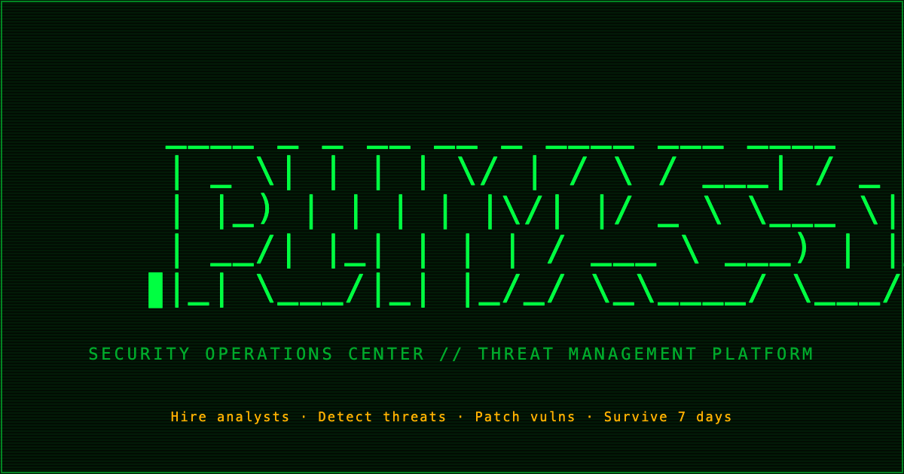
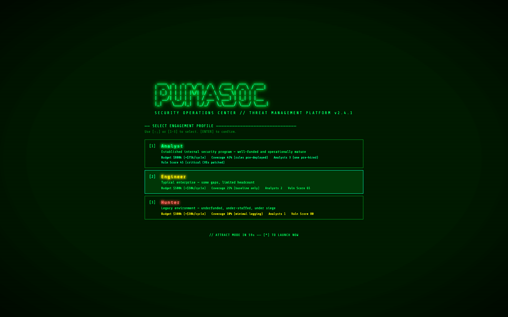

# PumaSOC

A browser-based retro cyberpunk Security Operations Center management game. Defend your client estate against nation-state and criminal threat actors across 7 game days.



## Play

Open `index.html` in any modern browser. No build step, no dependencies (except Google Fonts for typography).

A local server gives the best experience:

```bash
python3 -m http.server 8742
# then open http://localhost:8742/
```

## How to Play

You run a global SOC. Threats spawn continuously — your job is to detect, respond, and harden before they breach.

**Win:** Survive 7 game days with fewer than 3 breaches.
**Lose:** 3 successful breaches.

### Core Loop

1. Threats probe your estate. Your **Detection Coverage %** determines whether they're caught immediately on spawn.
2. Detected threats create **incidents** in the centre panel — assign an analyst to start IR.
3. Undetected threats silently dwell and breach after a difficulty-dependent window.
4. Unhandled incidents also breach if left unassigned too long.
5. A **Lessons Learned** prompt appears after each resolved incident — click it for a +1% IR speed bonus per technique category (stacks up to +25%). It expires after ~2 game hours.
6. Analysts work incidents through four IR stages: **TRIAGE → CONTAIN → ERADICATE → RECOVER**.

### Difficulty



| | Analyst | Engineer | Hunter |
|---|---|---|---|
| Starting budget | $800k | $500k | $300k |
| Income / cycle | $75k | $50k | $30k |
| Starting analysts | 3 | 2 | 1 |
| Detection base | 45% | 25% | 10% |
| Vuln Score | 45 | 65 | 80 |
| Threat spawn rate | −25% | baseline | +20% |
| Undetected breach window | ~2.4 min | ~2 min | ~1.6 min |
| Unhandled breach window | ~4.8 min | ~4 min | ~3.2 min |

Times are at 1× speed. On Hunter, 90% of threats spawn undetected — invest in Detection Engineering immediately and hire a second analyst before the backlog builds.

### Capabilities

#### Analyst Activities

These require a free analyst and budget:

| Action | Cost | Effect |
|---|---|---|
| **Hire Analyst** | $75k | Add a responder (max 8) — each handles one incident at a time |
| **Send to Training** | $50k | Takes an analyst offline for 24 game hours; permanently boosts all analyst IR speed by 10% (max +30%) |
| **Threat Hunt** | $60k | Sends an analyst to proactively search for hidden threats (4 game hours) |
| **Tabletop Exercise** | $25k | Runs a scenario exercise — +15% IR speed bonus for 2 game hours |
| **Patch Sprint** | $25k | Analyst remediates all LOW-severity vulnerabilities |
| **OSINT Research** | $40k | 12 game hours of open-source intel gathering — loads 3 charges for guaranteed threat detection |

#### Defensive Capabilities

| Action | Cost | Effect |
|---|---|---|
| **Detection Eng** | $25k–$50k | Upgrade SIEM rules per ATT&CK category — +5% Coverage per level, 5 levels max per category. Cost scales with level. |
| **Vuln Mgmt** | $15k scan | Scan infrastructure to discover vulnerabilities, then patch individually by severity (CRIT/HIGH/MED/LOW). Lowers Vuln Score and reduces threat spawn rate. |
| **SOAR Platform** | $100k + $20k/playbook | Deploys automation playbooks that accelerate TRIAGE and CONTAIN stages (+25–50% speed). 12 playbooks available. |
| **Threat Intel** | $30k–$190k | Subscribe to intel feeds for passive Coverage and MTTD boosts. Each feed lasts 7 game days. |

#### Partners

| Action | Cost | Effect |
|---|---|---|
| **Red Team** | $30k–$150k | Commission engagements (network pentest, phishing sim, internal assessment, cloud review, full red team). Suppresses attack categories and discovers hidden vulnerabilities. |
| **Security Awareness** | $20k–$100k | Train staff in phishing resistance across 3 tiers (Phishing Sim, Awareness Program, Human Risk Mgmt). Blocks social engineering attacks and raises Coverage. |
| **MSSP** | $100k–$350k startup | Outsource SOC operations across 3 tiers: Alert Monitoring (auto-assign), Co-Managed (+ lessons learned + 10% IR), Fully Managed (+ overflow capacity + 15% IR). Renewal fees per income cycle. |
| **Consultant** | $75k | Retains an expert for 7 game days — provides daily prioritised recommendations and passive defensive bonuses |

### Random Events

Periodically the game throws a crisis: DDoS barrages, tool outages, zero-days, insider threats, and emergency budget audits. Active crises appear in the left panel and may temporarily penalise Coverage % or drain budget.

### Controls

| Key | Action |
|---|---|
| `Space` | Pause / Resume |
| `1` `2` `3` `4` | Game speed (1×–4×) |
| `?` | How to play |
| `M` | Mute / unmute |

**NEW GAME** button in the header resets to the difficulty screen.

### Persistence

The game auto-saves every ~10 real seconds and whenever you navigate away or close the tab. On reload, it picks up exactly where you left off. State is stored in `localStorage` under key `pumasoc_save`.

## Threat Actors

APT28 (Fancy Bear), APT29 (Cozy Bear), Lazarus Group, APT41, Sandworm, Volt Typhoon, FIN7, REvil, BlackCat, LockBit, TA505, SkidNet, and others — each with distinct skill ratings (1–5) affecting detection difficulty and attack speed. Threat actors escalate through campaign phases; phase 3 actors are more skilled and breach faster.

## Tech

Single HTML file (~6500 lines). Vanilla JS game loop at 100ms ticks. No frameworks, no build tooling.
